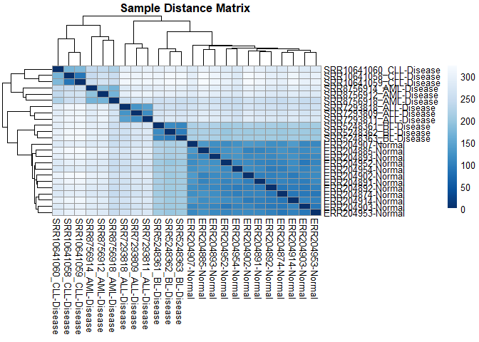

RNA-seq analyses pipeline for cancer research
================
### Author
**Name**: Albert Doughan  
**Institution**: Kwame Nkrumah University of Science and Technology, Ghana  
**Email**: doughan.albert@gmail.com 


# **Introduction**

This tutorial describes in details how to perform differential gene
expression analysis in RNA-seq studies. Since its introduction in 2009,
RNA-seq has been used in several projects to establish the gene
expression profiles of cancer patients through the identification of
differentially expressed genes. Although there are several available
tools that can be used here, this tutorial focuses on **DESeq2** using
count data from **HISAT2** aligner.

#### Data description

The dataset used in this tutorial was generated from patients with Acute
lymphoid leukemia, Chronic lymphocytic leukemia, Acute Myeloid leukemia
and Burkitt lymphoma. The goal of this project was to identify a single
gene expression profile for these hematological malignancies, which
could serve as prognostic, diagnostic and therapeutic targets. The
dataset contains 4 samples per cancer (12 in all) and a corresponding 12
samples from normal non-cancer individuals. Prior to differential
expression analysis, we need to ensure that our data has been well
cleaned and aligned to the human reference genome to identify the number
of reads/sequences that map to a known gene/transcript.

#### Quality Control, Trimming, Alignment and quantification

As with all next generation sequencing data analyses, we checked the
quality of the raw RNA-seq files with FastQC/MultiQC. Low quality bases,
adapter sequences and short reads were trimmed with Trimmomatic. The
reads were then aligned to the human reference genome (GRCh38) with
HISAT2 aligner. Finally, the number of sequences that mapped to known
genes/transcripts were quantified/counted with featureCounts.

The tools above can be installed by following their respective
documentations and manuals below:

1.  FastQC: <https://www.bioinformatics.babraham.ac.uk/projects/fastqc/>
2.  MultiQC: <https://multiqc.info/>
3.  Trimmomatic:
    <http://www.usadellab.org/cms/uploads/supplementary/Trimmomatic/TrimmomaticManual_V0.32.pdf>
4.  HISAT2: <http://www.ccb.jhu.edu/software/hisat/manual.shtml>
5.  featureCounts:
    <https://www.rdocumentation.org/packages/Rsubread/versions/1.22.2/topics/featureCounts>
6.  Samtools: <http://www.htslib.org/doc/samtools.html>

**NOTE**: In all the scripts below, replace the **`/path/to/`** with the
actual path to your respective files. Below are the bash scripts used to
perform the above steps:

#### Quality control

    fastqc -t 2 -o /path/to/output/folder *.fastq.gz

The `-t 2` specifies the number processors to be used. If unsure, remove
it.

The output from FastQC can be summarized with MultiQC:

    multiqc .

#### Trimming

    #!/bin/bash
    output=/path/to/output/folder
    input=/path/to/input/folder
    for i in $input/*_1.fastq.gz;
    do
    withpath="${i}" filename=${withpath##*/}
    base="${filename%*_*.fastq.gz}"
    sample_name=`echo "${base}" | awk -F ".fastq.gz" '{print $1}'` 
    trimmomatic PE -threads 2 -trimlog $output/"${base}".log $input/"${base}"_1.fastq.gz $input/"${base}"_2.fastq.gz $output/"${base}"_1.trimmed_PE.fastq.gz $output/"${base}"_1.trimmed_SE.fastq.gz $output/"${base}"_2.trimmed_PE.fastq.gz $output/"${base}"_2.trimmed_SE.fastq.gz ILLUMINACLIP:TruSeq3-PE-2.fa:2:30:10:2:keepBothReads LEADING:3 TRAILING:3 SLIDINGWINDOW:4:15 MINLEN:20
    done

The script above is for pair-end RNA-seq reads. For more information on
the meaning of parameters and script for single-end reads, visit the
[manual/documentation](http://www.usadellab.org/cms/uploads/supplementary/Trimmomatic/TrimmomaticManual_V0.32.pdf).

#### Recheck the quality of trimmed reads to ensure trimming was effective

    fastqc -t 2 -o /path/to/output/folder *PE.fastq.gz

#### Summarize output with MultiQC

    multiqc .

#### Alignment of reads to the human reference genome

Prior to the actual alignment stage, we need to create genome index
files from the reference genome. This can be done with the code below:

    hisat2-build -p 2 /path/to/Homo_sapiens.GRCh38.dna.primary_assembly.fa hisatindex

The reference genome file can be downloaded
[here](ftp://ftp.ensembl.org/pub/release-90/fasta/homo_sapiens/dna/Homo_sapiens.GRCh38.dna.primary_assembly.fa.gz)

**Note**: Depending on the memory capacity of your PC or server, this
step can take a while to complete.

#### Actual alignment stage

Here, we’ve combined two analysis steps. The first part aligns our
trimmed data to the human reference genome using HISAT2. The second
portion converts the output SAM format to BAM, and finally, the BAM
files are sorted by coordinates.

    #!/bin/bash
    input=/path/to/input/folder
    output=/path/to/output/folder
    for i in $input/*_1.trimmed_PE.fastq.gz;
    do 
    withpath="${i}" filename=${withpath##*/} 
    base="${filename%*_*1.trimmed_PE.fastq.gz}"
    sample_name=`echo "${base}" | awk -F "1.trimmed_PE.fastq.gz" '{print $1}'`
    hisat2 -p 2 -x /path/to/hisatindex -1 $input/"${base}"*_1.trimmed_PE.fastq.gz -2 $input/"${base}"*_2.trimmed_PE.fastq.gz -S $output/"${base}".hisat.sam --summary-file $output/"${base}".txt 
    echo "$sample_name done!"
    samtools view -@ 2 -m 2G -ub $output/"${base}".hisat.sam -o $output/"${base}".hisat.bam
    echo "${sample_name} hisat.sam change to bam done!"
    samtools sort -n -@ 2 -m 2G -T /tmp/ $output/"${base}".hisat.bam -o $output/"${base}".hisat.sorted.bam
    echo "${sample_name} hisat.sorted.bam sort done!"
    echo "$base done!"
    done

Explanation of the parameters can be found in the tools’ documentation.

#### Quantification step

This step counts the number of times a sequence maps to a genetic
feature (gene or transcript) in the human reference genome. The output
is a “countdata” file which will be used for differential expression
analysis in R in the next stage. The “countdata” contains Ensembl gene
IDs and sample names as row and column headers respectively. Each row
represents a gene/transcript with their respective counts in each of the
samples.

    featureCounts -p -T 2 -t exon -g gene_id --extraAttributes gene_id,gene_biotype -a /path/to/Homo_sapiens.GRCh38.92.gtf -o hisat2.txt *.sorted.bam

H3ABioNet has a very good tutorial on the above steps. Follow [this
link](https://h3abionet.github.io/H3ABionet-SOPs/RNA-Seq) to read more
on it.

<br />

#### Differential expression analysis in R

DESeq2 is popular tool used to identify differentially expressed genes
between two or conditions of interest, in this case, two (disease vrs
control). It uses the [negative binomial
model](https://en.wikipedia.org/wiki/Negative_binomial_distribution) for
differential expression tests. Aside the DESeq2, other packages will
have to be installed in R. These are `pheatmap`, `RColorBrewer`,
`DESeq2`, `ggplot2`, `affy` and `ggfortify`. Installation codes and
guidelines are provided in subsequent steps.

Two other files will be required:

1.  Coundata: This contains the read counts per sample obtained after
    genome mapping.
2.  Meta data file: This is a user-defined CSV files with two columns
    (SampleID and Condition).

The countdata and meta data files used in this tutorial can be
downloaded
[here](https://drive.google.com/drive/folders/183mQmsTIQ0xyClEFVSunscr3MZmsJU-z?usp=sharing)

### Setting up R and RStudio environment

R is a free programming language that provides a user-friendly
environment for data analysis and programming. RStudio is a more
user-friendly environment that allows users to interact with R more
easily and readily. It belongs to a group of programs called integrated
development environment (IDE). If you do not already have [R statistical
tool](https://cloud.r-project.org/bin/windows/base/R-4.0.5-win.exe) and
[RStudio](https://download1.rstudio.org/desktop/windows/RStudio-1.4.1106.exe)
installed, they can be downloaded from their respective websites.

### Installing all required packages

Before testing for differential expression, we need to install some R
packages. These packages are maintained by
[Bioconductor](https://bioconductor.org/). To install a package, copy
and paste the name of the package in the search box on the top right
corner of the Bioconductor page, select the first result and you should
be presented with a page with a code like the one below:

``` r
if (!requireNamespace("BiocManager", quietly = TRUE))
    install.packages("BiocManager")

BiocManager::install("DESeq2")
```

Copy and paste this code into RStudio and click *Run* on top of the
page. You could also highlight the entire code and press **Ctrl +
Enter** to run the code. Repeat the step above by replacing the name of
the package *" DESeq2"* with the next package name. Do this for all
packages.

### Setting up working directory

Next, we set our working directory (where are input and output files
will the saved), which will enable us to circumvent specifying long
paths to our input files. We do this by following the steps:

1.  Create a folder on your desktop and name it *RNA-seq*.
2.  Move the countdata and metadata files you downloaded into the
    *RNA-seq* folder.
3.  The path to the *RNA-seq* folder will be something like
    **`"C:/Users/Albert Doughan/Desktop/RNA-seq"`**

Remember to replace `"Albert Doughan"` with your username. The codes
below will set your working directory as described above.

``` r
setwd("C:/Users/Albert Doughan/Desktop/RNA-seq")
dir = "C:/Users/Albert Doughan/Desktop/RNA-seq"
```

### Loading all required packages into R

Successfully installing a package does not automatically load it. Just
as having a smart phone does not automatically send WhatsApp messages.
You will have to install WhatsApp, open (load) it, before you can send a
message. To load (open) an installed package in Rstudio, type *library*,
open a bracket, open inverted commas, type the name of package and close
the inverted commas and brackets. An example is show below.

``` r
library("pheatmap")
library("RColorBrewer")
library("DESeq2")
library("ggplot2")
library("affy")
library("ggfortify")
```

The codes above will load the respective packages into R.

### Loading the input data.

As described above, two files will be needed to perform differential
expression analysis: a metadata and countdata. These will be imported
into R with the following lines of code.

``` r
metadatah = read.csv(file= "metadata.csv", header=TRUE, sep = ",")
counts <- read.csv("hisat2.csv", header=TRUE, sep = ",")
```

Both files have column names, so we set `header=TRUE`. Our data points
are separated by commas (`sep = ","`)

We can take a sneak peak at the head (first 6 rows of our data)

``` r
head(metadatah)
```

    ##    SampleID Condition
    ## 1 ERR204874    Normal
    ## 2 ERR204885    Normal
    ## 3 ERR204891    Normal
    ## 4 ERR204892    Normal
    ## 5 ERR204893    Normal
    ## 6 ERR204902    Normal

The countdata is quite disorganized, so displaying the `head` at this
point will not be interesting.

### Data preprocessing

The countdata contains some columns which are irrelevant to our analysis
and will be removed. These include the chromosome numbers, start and end
positions, gene length and gene biotype. DESeq2 does not need this
information to perform differential expression analysis, hence dropped
with the following code.

``` r
countdata = counts[, c(7:32)]
countdata = countdata[, -c(2)]
countdata <- countdata[, -c(1)]
rownames(countdata) <- counts[,1] 
```

Let’s inspect the first 6 rows of the new countdata.

``` r
head(countdata)
```

    ##                 ERR204874 ERR204885 ERR204891 ERR204892 ERR204893 ERR204902
    ## ENSG00000223972         0         0         0         0         0         0
    ## ENSG00000227232        11        30        24        24        13        14
    ## ENSG00000278267         1         1         1         1         0         2
    ## ENSG00000243485         0         0         0         0         0         0
    ## ENSG00000284332         0         0         0         0         0         0
    ## ENSG00000237613         0         0         0         0         0         0
    ##                 ERR204903 ERR204907 ERR204914 ERR204952 ERR204953 ERR204954
    ## ENSG00000223972         0         0         0         0         0         0
    ## ENSG00000227232        17         9        12        52        49        26
    ## ENSG00000278267         3         0         0         1         0         6
    ## ENSG00000243485         0         0         0         0         0         0
    ## ENSG00000284332         0         0         0         0         0         0
    ## ENSG00000237613         0         0         0         0         0         0
    ##                 SRR10641058_CLL SRR10641059_CLL SRR10641060_CLL SRR5248361_BL
    ## ENSG00000223972               0               0               0             0
    ## ENSG00000227232              18               9              17           169
    ## ENSG00000278267               2               2               1             7
    ## ENSG00000243485               0               0               0             0
    ## ENSG00000284332               0               0               0             0
    ## ENSG00000237613               0               0               0             0
    ##                 SRR5248362_BL SRR5248363_BL SRR7293809_ALL SRR7293811_ALL
    ## ENSG00000223972             0             0              0              2
    ## ENSG00000227232            45            24            292            257
    ## ENSG00000278267             2             1             29             19
    ## ENSG00000243485             0             0              3              0
    ## ENSG00000284332             0             0              0              0
    ## ENSG00000237613             0             0              0              0
    ##                 SRR7293818_ALL SRR8756912_AML SRR8756914_AML SRR8756918_AML
    ## ENSG00000223972              0              1              4              0
    ## ENSG00000227232            212             58             81             35
    ## ENSG00000278267             28              6             29             11
    ## ENSG00000243485              2              1              3              6
    ## ENSG00000284332              0              0              0              0
    ## ENSG00000237613              0              0              0              0

To ensure the metadata and countdata have the same samples names, we run
the code below. This will return **TRUE** if the names in both files are
the same. In all there are **24** samples in both files.

``` r
table(colnames(countdata)==metadatah$SampleID)
```

    ## 
    ## TRUE 
    ##   24

**Great\!\!**. All is set now to perform differential expression
analysis with DESeq2.

### Differential expression analysis with DESeq2

All the steps required to perform differential expression has been
placed into a single function, `DESeq`. More details on the respective
steps can be found in the [DESeq2
paper](http://www.bioconductor.org/packages/release/bioc/vignettes/DESeq2/inst/doc/DESeq2.html#theory).
You could also type and run `?DESeq` to read more on the steps.

#### Create the DESeqDataSet object from the countdata and metadata

DESeq2 uses `DESeqDataSet` to store read counts and other intermediate
calculations needed for differential expression analysis. This is
represented in the code below as `dds` (`d` for DESeq, `d` for Data and
`s` for set). The basic idea behind this is to coerce the countdata and
metadata into a format DESeq2 can accept and work with. We do this with
the `DESeqDataSetFromMatrix` function.

``` r
dds <- DESeqDataSetFromMatrix(countData = round(countdata),
                              colData = metadatah,
                              design = ~Condition)
```

Check the number of genes in the dataset

``` r
nrow(dds)
```

    ## [1] 58395

There are 58395 genes in our samples

#### Remove Genes with low counts

Removing genes with low count will reduce the memory size of the `dds`
object and increase the speed of subsequent steps. Moreover, genes with
very low counts will not be interesting biologically. The code below
will keep genes with at least 10 counts in the samples.

``` r
dds1 <- dds[ rowSums(counts(dds)) >= 10, ]
nrow(dds1)
```

    ## [1] 34456

Removing low count genes reduces the number from 58395 to 34456.

<br />

#### Data quality assessment.

Quality control is an important step in any data analysis. Since our
purpose is to identify differentially expressed genes, we will exclude
samples with anomalies that will render our results inconclusive. This
will also enable us to visually appreciate our data. In the ensuing
steps, we will explore our data by plotting PCA, density plots and
heatmaps.

#### Principal component analysis

This could be used to visualize the effect of experimental parameters
and batch effects present in the dataset.

``` r
PCAdata <- prcomp(t(assay(dds1)))
autoplot(PCAdata, data = metadatah,colour = "Condition", label = FALSE)
```

<!-- -->

Here, we observe that there are no clear clusters formed as expected for
our cases and control groups. Let’s try a hierarchical clustering to see
if the problem persists.

#### Hierarchical clustering

This could also be used to cluster the samples based on dissimilarity
indexes. More information can be found with `?hclust`.

``` r
clusters2 <- hclust(dist( t( assay(dds1) ) ), method ="ward.D")
plot(clusters2, labels = FALSE)
```

<!-- -->

The tree above has two main branches, which a better, however, the
sub-branches do not match our number of cases and controls. Let’s try
one last exploratory plot.

#### Density plot

A Density Plot can be used to visualize the distribution of data over a
continuous interval. In RNA-seq analysis, this could be used to detect
the presence or absence of batch effects in the data. Batch effects may
be introduced through different experimental platforms, laboratory
conditions, different sources of samples, different technicians, etc,
and may introduce spurious variability which is not due to the condition
under study (cancer). [This
paper](https://www.ncbi.nlm.nih.gov/pmc/articles/PMC4636836/)
comprehensively discusses batch effects and how they can be corrected.

``` r
plotDensity(assay(dds1), col=1:24,lwd=2,lty=1,xlab("Density"),ylab("Counts"))
```

<!-- -->

This is not a good density plot and it seems we need to fix something in
the data. The good news is that this can be done through
**normalization**\!\!.

#### Normalization

The main motive behind normalization is to change numeric values in a
dataset to a common scale without distorting the differences. This
reduces the sparsity of the data as they are brought to a common close
scale. There are several normalization methods that can be applied to
our data. However, due the large number of samples, we recommend
Variance Stabilizing transformation (VST) method as this performs quite
well on large samples.

``` r
vst = vst(dds1, blind=FALSE)
```

`blind=FALSE` greatly reduces the run time.

Now let’s generate the plots again and assess if normalization made any
difference.

#### Principal component analysis after normalization

``` r
PCAdata <- prcomp(t(assay(vst)))
autoplot(PCAdata, data = metadatah,colour = "Condition",label = FALSE, main="PCA")
```

<!-- -->

It seems VST normalization has greatly improved our PCA plot. The
RNA-seq data used in this project were obtained from 3 cancer types,
which have been clustered as such (in red). The normal control samples
are also clustered nicely.

#### Hierarchical clustering after normalization

``` r
clusters2 <- hclust(dist( t( assay(vst) ) ),method ="ward.D")
plot(clusters2, main = "Dendrogram", label = metadatah$Condition)
```

<!-- -->

Wow\!\! This also shows an excellent cluster for both cases and control
groups.

#### Density plot after normalization

``` r
plotDensity(assay(vst), lwd=2,lty=1,xlab("Density"),ylab("Counts"), main = "Density plot")
```

<!-- -->

This is better than the previous and is typical of RNA-seq data.
However, the unevenness of the plot may suggest the presence of batch
effects. More details on this is available in [DESeq2’s
manual](http://www.bioconductor.org/packages/release/bioc/vignettes/DESeq2/inst/doc/DESeq2.html#exploring-and-exporting-results)

#### Heatmap

This is used to explore the sample-to-sample distance within the data.
This gives a general overview of the similarities and dissimilarities
within the samples. We first calculate the Euclidean distance between
samples with `dist`.

``` r
sampleDists <- dist( t( assay(vst) ) )
sampleDistMatrix <- as.matrix( sampleDists )
rownames(sampleDistMatrix) <- paste( vst$SampleID,vst$Condition, sep="-" )
colnames(sampleDistMatrix) <- paste( dds1$SampleID,dds1$Condition, sep="-")
colors <- colorRampPalette( rev(brewer.pal(9, "Blues")) )(255)
pheatmap(sampleDistMatrix,
         clustering_distance_rows=sampleDists,
         clustering_distance_cols=sampleDists,
         col=colors, main = "Sample Distance Matrix ")
```

<!-- -->

The plot shows a high level of dissimilarity among the disease samples.
This makes sense as the dataset was obtained from 4 cancer types.
However, the normal samples showed a high level of similarity

<br />

#### Run the DESeq function to perform differential expression analysis

The `DEseq` function performs the following on the `dds` object we
created

1.  Estimation of size factors
2.  Estimation of dispersion
3.  Negative Binomial GLM fitting and Wald statistic For detailed
    explanation, kindly refer to the [DESeq2
    paper](http://www.bioconductor.org/packages/release/bioc/vignettes/DESeq2/inst/doc/DESeq2.html#theory).

<!-- end list -->

``` r
dds1 <- DESeq(dds1)
```

Inspect the header of the newly created object

``` r
head(assay(dds1)) 
```

    ##                 ERR204874 ERR204885 ERR204891 ERR204892 ERR204893 ERR204902
    ## ENSG00000227232        11        30        24        24        13        14
    ## ENSG00000278267         1         1         1         1         0         2
    ## ENSG00000243485         0         0         0         0         0         0
    ## ENSG00000238009         1         0         0         0         1         0
    ## ENSG00000233750         0         0         3         0         1         0
    ## ENSG00000268903         1         6         6         3         4         5
    ##                 ERR204903 ERR204907 ERR204914 ERR204952 ERR204953 ERR204954
    ## ENSG00000227232        17         9        12        52        49        26
    ## ENSG00000278267         3         0         0         1         0         6
    ## ENSG00000243485         0         0         0         0         0         0
    ## ENSG00000238009         0         0         0         0         0         2
    ## ENSG00000233750         0         0         1         0         0         1
    ## ENSG00000268903         3         0         3         0         3        13
    ##                 SRR10641058_CLL SRR10641059_CLL SRR10641060_CLL SRR5248361_BL
    ## ENSG00000227232              18               9              17           169
    ## ENSG00000278267               2               2               1             7
    ## ENSG00000243485               0               0               0             0
    ## ENSG00000238009               0               0               0             0
    ## ENSG00000233750               0               0               0             1
    ## ENSG00000268903               1               0               4             4
    ##                 SRR5248362_BL SRR5248363_BL SRR7293809_ALL SRR7293811_ALL
    ## ENSG00000227232            45            24            292            257
    ## ENSG00000278267             2             1             29             19
    ## ENSG00000243485             0             0              3              0
    ## ENSG00000238009             0             1              0              1
    ## ENSG00000233750             0             1              0              0
    ## ENSG00000268903             0             1              3             13
    ##                 SRR7293818_ALL SRR8756912_AML SRR8756914_AML SRR8756918_AML
    ## ENSG00000227232            212             58             81             35
    ## ENSG00000278267             28              6             29             11
    ## ENSG00000243485              2              1              3              6
    ## ENSG00000238009              2              0              0              5
    ## ENSG00000233750              1              4              2              2
    ## ENSG00000268903              8              8              1              5

#### Building the results table

The results table is a dataframe that contains our differentially
expressed genes, their p-values, whether the genes are upregulated or
downregulated, presence or absence of outliers, etc. `summary` gives us
the genes that are up and down regulated in our condition under study,
as well as low count genes and outliers. This generates summary tarries
for the data. You can read about more about the results function by
looking up `?results`

``` r
res_table <- results(dds1)
summary(res_table)
```

    ## 
    ## out of 34421 with nonzero total read count
    ## adjusted p-value < 0.1
    ## LFC > 0 (up)       : 4099, 12%
    ## LFC < 0 (down)     : 14399, 42%
    ## outliers [1]       : 0, 0%
    ## low counts [2]     : 3372, 9.8%
    ## (mean count < 1)
    ## [1] see 'cooksCutoff' argument of ?results
    ## [2] see 'independentFiltering' argument of ?results

Here, we found no outliers, and had 9.8% low counts genes.

#### Working with alpha 0.05

By default, the `result` function uses an adjusted p-value cutoff of
0.1. If any other p value is to be selected, `alpha` should be set to
that value, as shown below where we set `alpha=0.05`.

``` r
res2 <- results(dds1, alpha=0.05)
```

We could also count the number of differentially expressed genes with
adjusted p-values were less than 0.05. `na.rm=TRUE` removes any row with
missing information.

``` r
sum(res2$padj < 0.05, na.rm=TRUE)
```

    ## [1] 16141

So out of the 34456 filtered genes, only 16141 have adjusted p-values
less than 0.05. Let’s go ahead and selected them.

``` r
res_sig <- subset(res2, padj < 0.05)
dim(res_sig)
```

    ## [1] 16141     6

We then order the identified genes by the smallest p value:

``` r
res_small_p <- res_sig[order(res_sig$pvalue),]
dim(res_small_p)
```

    ## [1] 16141     6

Finally, we write the differentially expressed gene list to file

``` r
write.csv(as.data.frame(res_small_p), "DESeq2_hisat.csv")
```

<br /> <br />

<br />

#### Session information

``` r
sessionInfo()
```

    ## R version 4.0.3 (2020-10-10)
    ## Platform: x86_64-w64-mingw32/x64 (64-bit)
    ## Running under: Windows 10 x64 (build 19042)
    ## 
    ## Matrix products: default
    ## 
    ## locale:
    ## [1] LC_COLLATE=English_United States.1252 
    ## [2] LC_CTYPE=English_United States.1252   
    ## [3] LC_MONETARY=English_United States.1252
    ## [4] LC_NUMERIC=C                          
    ## [5] LC_TIME=English_United States.1252    
    ## 
    ## attached base packages:
    ## [1] parallel  stats4    stats     graphics  grDevices utils     datasets 
    ## [8] methods   base     
    ## 
    ## other attached packages:
    ##  [1] ggfortify_0.4.11            affy_1.66.0                
    ##  [3] ggplot2_3.3.3               DESeq2_1.28.1              
    ##  [5] SummarizedExperiment_1.18.2 DelayedArray_0.14.1        
    ##  [7] matrixStats_0.58.0          Biobase_2.48.0             
    ##  [9] GenomicRanges_1.40.0        GenomeInfoDb_1.24.2        
    ## [11] IRanges_2.22.2              S4Vectors_0.26.1           
    ## [13] BiocGenerics_0.34.0         RColorBrewer_1.1-2         
    ## [15] pheatmap_1.0.12            
    ## 
    ## loaded via a namespace (and not attached):
    ##  [1] tidyr_1.1.3            bit64_4.0.5            splines_4.0.3         
    ##  [4] assertthat_0.2.1       highr_0.8              BiocManager_1.30.12   
    ##  [7] blob_1.2.1             GenomeInfoDbData_1.2.3 yaml_2.2.1            
    ## [10] pillar_1.5.1           RSQLite_2.2.5          lattice_0.20-41       
    ## [13] glue_1.4.2             digest_0.6.27          XVector_0.28.0        
    ## [16] colorspace_2.0-0       preprocessCore_1.50.0  htmltools_0.5.1.1     
    ## [19] Matrix_1.2-18          XML_3.99-0.6           pkgconfig_2.0.3       
    ## [22] genefilter_1.70.0      zlibbioc_1.34.0        purrr_0.3.4           
    ## [25] xtable_1.8-4           scales_1.1.1           affyio_1.58.0         
    ## [28] BiocParallel_1.22.0    tibble_3.1.0           annotate_1.66.0       
    ## [31] farver_2.1.0           generics_0.1.0         ellipsis_0.3.1        
    ## [34] cachem_1.0.4           withr_2.4.1            survival_3.2-7        
    ## [37] magrittr_2.0.1         crayon_1.4.1           memoise_2.0.0         
    ## [40] evaluate_0.14          fansi_0.4.2            tools_4.0.3           
    ## [43] lifecycle_1.0.0        stringr_1.4.0          munsell_0.5.0         
    ## [46] locfit_1.5-9.4         AnnotationDbi_1.50.3   compiler_4.0.3        
    ## [49] rlang_0.4.10           grid_4.0.3             RCurl_1.98-1.3        
    ## [52] labeling_0.4.2         bitops_1.0-6           rmarkdown_2.7         
    ## [55] gtable_0.3.0           DBI_1.1.1              R6_2.5.0              
    ## [58] gridExtra_2.3          knitr_1.31             dplyr_1.0.5           
    ## [61] fastmap_1.1.0          bit_4.0.4              utf8_1.2.1            
    ## [64] stringi_1.5.3          Rcpp_1.0.6             vctrs_0.3.7           
    ## [67] geneplotter_1.66.0     tidyselect_1.1.0       xfun_0.22

For detailed explanation on all the steps, kindly read the [DESeq2
paper](http://www.bioconductor.org/packages/release/bioc/vignettes/DESeq2/inst/doc/DESeq2.html#exploring-and-exporting-results)

<br />

**CONGRATULATIONS\!\!\!**. You are now a master of RNA-seq analysis with
HISAT2 and DESeq2.

<br />

##### In case you encounter any challenges, feel free to contact me via

[](https://twitter.com/adoughan1)  
<br />
[](https://www.linkedin.com/in/albert-doughan-4a7564aa/)  
<br />
[](https://web.facebook.com/alberto.doughani)
